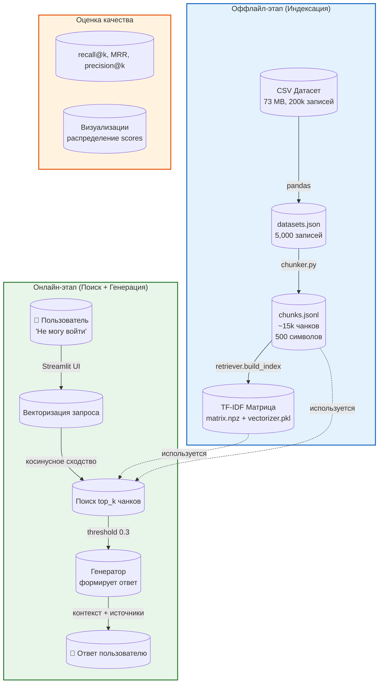

## Соглашения по разработке RAG-проекта

### 1. Границы изменений

**Принцип KISS (Keep It Simple, Stupid):**
- Каждый модуль решает **одну задачу**;
- Не добавляем избыточную функциональность;
- Не оптимизируем преждевременно;
- Код должен быть понятен студенту, изучающему RAG.

**Границы изменений:**
- Модифицируем только файлы, необходимые для выполнения задания:
  - `app/chunker.py` — изменение стратегии чанкинга;
  - `app/retriever.py` — добавление метрик оценки поиска;
  - `app/generator.py` — улучшение генератора;
  - `scripts/ingest.py` — адаптация под новый датасет;
  - `data/raw/datasets.json` — замена на свой датасет;
  - `homework/report.ipynb` — итоговый ноутбук.
  
**Запрещено:**
  - Переписывать архитектуру с нуля;
  - Добавлять новые внешние зависимости без крайней необходимости;
  - Менять интерфейсы существующих функций (чтобы не сломать тесты)
  - Добавлять сложные LLM/embeddings (это за рамками MVP).

### 2. Архитектура модулей

**Структура пайплайна (следуем существующей):**



**Обязанности модулей:**

| Модуль | Файл | Что делает | Что НЕ делает |
|--------|------|------------|----------------|
| **Ingest** | `scripts/ingest.py` + `app/config.py` | Читает `datasets.json`, передаёт тексты на чанкинг | Не изменяет исходный датасет |
| **Chunker** | `app/chunker.py` | Разбивает текст на чанки (по словам/параграфам) | Не трогает индексацию |
| **Index** | `app/retriever.py` (build_index) | Строит TF-IDF матрицу, сохраняет vectorizer | Не отвечает на запросы |
| **Retriever** | `app/retriever.py` (retrieve) | Ищет top-k чанков по запросу | Не генерирует ответ |
| **Generator** | `app/generator.py` | Формирует ответ из чанков или отказывает | Не занимается поиском |
| **Prompts** | `app/prompts.py` | Хранит правила отказа и форматирования | Не содержит логику |
| **UI** | `app/main.py` | Streamlit интерфейс, принимает запрос, показывает ответ | Не индексирует данные |

**Правила изменений:**
- Каждый модуль можно улучшать независимо (если не меняется интерфейс);
- Новый функционал добавляем в соответствующий модуль (не смешиваем);
- Тесты лежат в `tests/` и должны проходить после любых изменений.

### 3. Правила ответа (только по контексту, отказ без данных)

**Правила генератора (`app/generator.py` и `app/prompts.py`):**

| Ситуация | Действие | Пример |
|----------|----------|--------|
| Найден чанк со score > threshold (0.3) | Формируем ответ из контекста | "На основе обращения #123: проблема с входом решена сбросом пароля..." |
| Найден чанк, но score < threshold | Отказ ("нет уверенности") | "Я не уверен в ответе, так как найденные обращения недостаточно похожи." |
| Ни одного чанка не найдено (empty) | Отказ ("нет данных") | "Извините, я не могу найти информацию по вашему вопросу в базе знаний." |
| Запрос не по теме (кулинария, спорт, политика) | Отказ (доменное ограничение) | "Я могу отвечать только на вопросы, связанные с поддержкой клиентов." |
| Вопрос содержит нецензурную лексику | Отказ (безопасность) | "Пожалуйста, задайте вопрос корректно." |

**Формат ответа (стандарт):**
```markdown
**Ответ:** [сгенерированный текст]

**Источники:**
- Обращение #{doc_id} (релевантность: {score:.2f})
  {текст чанка[:X00]}...   # первые X00 символов/слов текста
