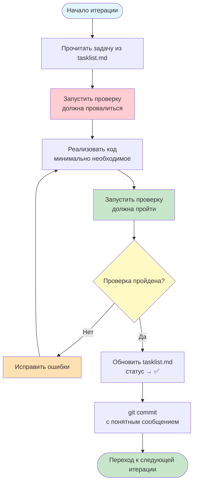

## Рабочий процесс выполнения итераций RAG-проекта

**Проект:** SupportRAG — умная система поиска и генерации ответов на основе обращений в службу поддержки  
**Датасет:** Customer Support Tickets (200,000+ записей, используем 5,000)  
**Цель:** Обеспечить прозрачный и воспроизводимый процесс разработки

---

## Цикл одной итерации

Каждая итерация следует единому циклу из 5 шагов:




---

## 1. Что делать до кода (Планирование)

Перед тем как писать код для любой итерации, выполните следующие действия:

| Действие | Описание | Пример |
|----------|----------|--------|
| **Прочитать задачу** | Открыть `doc/tasklist.md`, найти текущую итерацию, понять цель и задачи | "Итерация 2: Чанкинг и индексация — нужно настроить CHUNK_SIZE=500" |
| **Понять проверку** | Прочитать раздел "Проверка" в tasklist, подготовить команды для тестирования | `wc -l data/processed/chunks.jsonl` |
| **Проверить зависимости** | Убедиться, что предыдущие итерации завершены (их проверки проходят) | Запустить проверку из итерации 1 |
| **Подготовить окружение** | Активировать venv, установить нужные пакеты | `uv venv && uv sync` |
| **Создать ветку (опционально)** | Для сложных изменений — отдельная ветка | `git checkout -b iteration/02-chunking` |

**Чеклист готовности к коду:**
- [ ] Задача итерации понятна
- [ ] Команды проверки известны
- [ ] Предыдущие итерации (если есть) успешно завершены
- [ ] Окружение активировано

---

## 2. Как выполнять проверку (Реализация + Проверка)

### 2.1. Правило "Красный-Зелёный-Рефактор"

1. **Красный (до кода):** Запустите проверку из tasklist — она должна **провалиться** (потому что функционал ещё не реализован).
2. **Зелёный (после кода):** Реализуйте минимально необходимый функционал, запустите проверку — она должна **пройти**.
3. **Рефактор (опционально):** Улучшите код, не меняя поведение, проверка всё ещё проходит.

### 2.2. Команды проверки для каждой итерации

| Итерация | Команда проверки | Что проверяем |
|----------|------------------|---------------|
| 0 | `uv run pytest tests/ -v` | Все тесты проходят |
| 1 | `python -c "import json; print(len(json.load(open('data/raw/datasets.json'))))"` | 5000 записей |
| 2 | `wc -l data/processed/chunks.jsonl` | >1000 чанков |
| 3 | `uv run python scripts/check_retrieval.py --query "Не могу войти"` | scores > 0.3 |
| 4 | `uv run python scripts/check_generator.py --query "Как изменить оплату"` | ответ из контекста |
| 5 | `uv run python scripts/evaluate.py` | recall@3 > 0.6 |
| 6 | `uv run python scripts/check_generator.py --query "Как приготовить борщ"` | отказ |
| 7 | `jupyter nbconvert --execute homework/report.ipynb` | ноутбук выполняется |
| 8 | `uv run pytest tests/ -v && uv run python scripts/build_index.py && ...` | всё зелёное |

### 2.3. Если проверка не прошла

1. Прочитайте сообщение об ошибке
2. Определите, какая часть задачи не выполнена
3. Вернитесь к реализации, исправьте
4. Снова запустите проверку
5. Повторяйте, пока проверка не пройдёт

**Тайм-аут на одну итерацию:** не более 2 часов. Если не получается — обратитесь к преподавателю.

---

## 3. Когда обновлять tasklist

`doc/tasklist.md` — это **живой документ**, который отражает реальный прогресс.

### Обновляйте статус в таблице прогресса:

---
| Итерация | Название | Статус | Дата завершения | Проверка |
|----------|----------|--------|-----------------|----------|
| 0 | Настройка окружения | ✅ | 2026-06-10 | ✅ |
| 1 | Загрузка датасета | ✅ | 2026-06-10 | ✅ |
| 2 | Чанкинг и индексация | 🔄 | — | ⬜ |

---

## 4. Правила коммита и перехода дальше

### 4.1. Правила коммита (Conventional Commits)

Каждый коммит должен иметь осмысленное сообщение:

```bash
# Формат
<type>(<scope>): <subject>

# Примеры
feat(retriever): add recall@k metric implementation
fix(generator): handle empty query without crash
docs(workflow): add iteration cycle diagram
test(chunker): add test for chunk overlap
chore(deps): update pandas to 2.0.3
```
